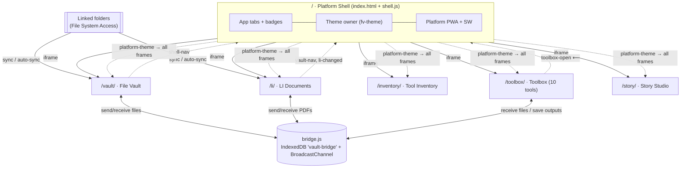

# File Database — Feature Tree & Application Topology

> A complete map of the platform: every feature, what it does, and what it's tied into.
> Matches the code as of this document's last commit. See `README.md` for user-facing docs.

---

## 0. Bird's-eye view

**File Database** is a static, no-build, offline-first PWA platform. The repo root is a
slim **shell** that hosts six independent apps in lazy, same-origin iframes. Apps never
talk to each other directly — everything cross-app goes through two thin channels:

- **`bridge.js` (VaultBridge)** — file handoffs (IndexedDB mailbox + BroadcastChannel nudge).
  Durable delivery: items are claimed with a time-limited lease and acknowledged (deleted)
  only after the receiver's handler promise settles, so a rejected handler or a crashed
  receiver never loses a file, and two live receivers process each item exactly once.
- **`postMessage`** — navigation + theme signals, always via the shell



Every app also runs **standalone** at its own URL with its own service worker and manifest —
the shell is a convenience layer, not a dependency.

---

## 1. Platform Shell — `/` (`index.html`, `shell.js`, `shell.css`, `sw.js`, `manifest.webmanifest`)

The only component that knows all six apps exist. Owns everything shared.

```
Platform Shell
├── App switching
│   ├── Six tabs: 📁 Files · 🗄️ LI Documents · 🔧 Tool Inventory · 🧰 Toolbox · ✍️ Story Studio · 🔓 Extract
│   ├── Lazy iframes — an app loads on first visit, then stays warm (instant switching)
│   ├── One panel visible at a time (ARIA tab pattern: arrow keys, Home/End, roving tabindex)
│   └── Last-used app remembered (localStorage "fd-app") and restored on launch
├── Unified file intake (ONE front door for the whole platform)
│   ├── "＋ Add files" button + one hidden <input> + a full-window drop zone, all in the top bar
│   ├── Auto-routing (silent, no prompt): a PDF whose NAME carries a Mercedes
│   │   document number (LI_DOCNUM, same pattern the LI app uses) → LI Documents;
│   │   every other file → Files (the Vault)
│   ├── The platform's OWN formats open in their app instead of being stored as blobs:
│   │   .tidb → Tool Inventory import · .fvault → vault restore · .lidb → LI restore
│   ├── Files landing in the vault get an immediate no-OCR VIN read (filename, text,
│   │   PDF text layer) — vehicle paperwork groups under its car with zero clicks;
│   │   files that would need OCR stay unstamped for the manual VIN scan to pick up
│   ├── Delivery: shell loads bridge.js and VaultBridge.send()s each file to its
│   │   target's outbox (meta.fromShell); ensures the target iframe is loaded so it ingests now
│   ├── Drops over an app's iframe are caught inside that app and forwarded up as
│   │   {shell-add-files} — so intake is unified no matter which tab is showing
│   ├── Single-target batch → that app is surfaced; mixed batch stays put; toast summarizes the split
│   └── The apps' own add buttons (Vault "Add files", LI "Import PDFs") are HIDDEN when embedded
├── Tab badges (live counts)
│   ├── Files count      ← peeks IndexedDB "file-vault" / store "files"
│   ├── LI docs count    ← peeks IndexedDB "LIDocsDB" / store "docs"
│   ├── Tools count      ← peeks IndexedDB "tool-inventory" / store "tools"
│   ├── Read-only peek with upgrade-abort guard — can NEVER create/corrupt an app's DB
│   └── Refreshes on: app switch · window focus · tab visible · {li-changed} message · after an add
├── Theme (single source of truth for every app)
│   ├── ◐ button cycles System → Light → Dark
│   ├── Persists: localStorage "fv-theme" (set for light/dark, REMOVED for system)
│   ├── Applies: data-theme attribute on <html> + theme-color meta swap
│   ├── Broadcasts {platform-theme, mode} to every loaded iframe, and once per iframe load
│   └── System mode live-follows the OS via a prefers-color-scheme listener
├── Deep links & legacy URLs
│   ├── #vault (alias #files) · #li · #inventory · #toolbox · #toolbox/<toolKey>
│   ├── RECORD-level links (subMessage router): #li/<LI number> opens that document ·
│   │   #li/group/54 ("LI54." precise search) · #li/model/214 · #li/search/<q> ·
│   │   #inventory/group/54 · #inventory/model/214 · #inventory/<toolNo> · #inventory/search/<q> ·
│   │   #vault/vin/<VIN> · #vault/search/<q>
│   ├── hashchange while open switches apps in place (and re-forwards the sub-path)
│   ├── ?view=li|inventory → opens that app        (legacy hub URLs)
│   ├── ?view=starred / ?action=add → opens the vault WITH the query passed into its iframe
│   └── Consumed queries are stripped from the URL so reload follows the hash, not the shortcut
├── Pinned "Active Vehicle" (platform-wide current-car context; localStorage fd-vehicle)
│   ├── Pin from: vault By-VIN header 📌 · a file's Related chips · quick-open's VIN row
│   ├── Chip in the top bar: 🚗 …<VIN tail> (click = that vehicle's files) + ✕ unpin
│   ├── Scoping: vault → vin:<VIN> filter · LI + inventory → model series from the VIN's
│   │   Baumuster digits; applied on pin and on app first-load (BEFORE queued deep links,
│   │   so explicit navigation wins); unpin clears all three scopes
│   └── Front-door files headed to the vault while pinned get meta.vin → tagged with the
│       car (auto VIN detect UNIONS its findings instead of clobbering the pin)
├── Ctrl+K quick-open (ID router — works from inside any iframe, forwarded up)
│   ├── Recognizes an LI number → open that doc · a tool number (3-3-2-2-2) → open that tool ·
│   │   a 17-char VIN → that vehicle's files
│   └── Anything else → "Search Files / LI Documents / Tool Inventory" rows with the query carried over
├── One-click "Back up everything" (top-bar ⬇ button)
│   └── Commands each data app to run its own existing export — .fvault + .lidb + .tidb, staggered
├── Database File Viewer — the shell's 🔓 Extract tab (also standalone at /viewer.html;
│   Files ⋮ → "Extract a backup file…" jumps to it; deep link #viewer)
│   ├── Standalone, offline, ZERO dependencies (own ZIP reader/writer + format parsers inline)
│   ├── Opens .fvault (binary v2 + legacy JSON), .lidb (ZIP+manifest; stored or deflated
│   │   entries via DecompressionStream), .tidb — lists contents with sizes
│   ├── "Download all as ZIP" (STORE + CRC32, UTF-8 names, memory-safe: one file at a time;
│   │   4 GB ZIP limit guarded) or per-file downloads
│   ├── fvault → collection folders; lidb → readable "LI…_ver - Title.pdf" names from the
│   │   manifest; tidb → tools.csv + tools.json + photos/*.png
│   └── Precached by the shell SW + shipped in the USB build — data is never locked in
├── Toast relay + badge pulse (the platform feels like ONE app)
│   ├── Apps forward their toasts up as {shell-toast, app, msg}; the shell shows them app-prefixed
│   │   ONLY when that app's tab is in the background (foreground apps toast themselves)
│   └── Badge counts pulse when a background app's row count changes
├── Keyboard layer (forwarded from inside every iframe)
│   ├── Alt+1–5 switches apps · Ctrl/Cmd+K opens quick-open · "/" focuses search in every app
│   └── Escape closes quick-open / app overlays
├── Message hub (window "message" listener)
│   ├── {shell-nav, app, tab?, payload?} → activate app; payload (a ready-made app message,
│   │   e.g. {inventory-filter, grp}) is forwarded to the target — how cross-app links travel
│   ├── {vault-nav, to:"files"}       → activate vault (legacy contract, still honored)
│   ├── {li-changed}                  → refresh tab badges
│   ├── {shell-add-files, files}      → route files through the unified intake (forwarded iframe drop/paste)
│   ├── {shell-open-picker}           → open the platform file picker (from an app's empty-state)
│   ├── {shell-toast, app, msg}       → app-prefixed toast for background tabs + badge refresh
│   ├── {shell-switch, n} / {shell-quickopen} → keyboard forwarded from inside iframes
│   ├── Shell→app contracts: li-open/li-search/li-filter/li-restore/platform-backup ·
│   │   inventory-filter/inventory-open/inventory-search/inventory-import/platform-backup ·
│   │   vault-filter/vault-search/vault-restore/platform-backup (apps queue nav that
│   │   arrives before their DB boot finishes, then replay it)
│   └── Queues messages for not-yet-loaded frames; flushed on the frame's load event
├── PWA (the installable "one app")
│   ├── manifest id "/" — pre-platform installs upgrade in place
│   ├── Shortcuts: Add files (?action=add) · Starred (?view=starred) · #li · #inventory
│   └── ⤓ Install button on beforeinstallprompt; hidden after install
└── Service worker (cache "platform-shell-v2")
    ├── Precache: shell core (required) + bridge.js/toolbox/icons (tolerant — can't brick install)
    ├── Fetch: skips /vault/ /li/ /inventory/ paths entirely (their own SWs rule there)
    ├── Navigations network-first, cached per-URL; assets cache-first
    └── Activate: prunes own old caches + legacy pre-platform "file-vault-*" root caches
```

**Tied into:** all apps (iframes, theme broadcast; badges for the three data apps), three app IndexedDBs
(read-only), and `bridge.js` — which the shell now loads to *send* unified-intake files
to the Vault/LI outboxes (it still never *receives*; each app drains its own).

---

## 2. File Vault — `/vault/` (`index.html`, `app.js`, `db.js`, `styles.css`, `sw.js`, `vendor/pdf*.js`)

The general-purpose file database. The platform's "hub" for incoming files from every other app.

```
File Vault
├── Adding files (5 ways in)
│   ├── ＋ Add files button / a keyboard shortcut → file picker (multi-select)
│   ├── Drag & drop anywhere onto the window (global overlay)
│   ├── Paste from clipboard (window "paste" listener)
│   ├── Folder sync (see below) — automatic
│   └── Bridge deliveries from LI Documents and Toolbox — automatic
├── Classification & preview
│   ├── Auto-sorted by kind: Images · Videos · Audio · PDFs · Documents · Spreadsheets
│   │   · Presentations · Text & code · Archives · Other  (sidebar "Types" tree w/ counts)
│   ├── Thumbnails generated on-device:
│   │   ├── Images  → scaled canvas JPEG
│   │   ├── Videos  → mid-point frame grab
│   │   └── PDFs    → first page rendered via vendored pdf.js (v3.11.174)
│   │       ├── pdf.js lazy-loads only when a PDF needs a preview (~1.5 MB, then SW-cached)
│   │       ├── Existing PDFs back-filled in the background, one at a time, persisted
│   │       │   without touching updatedAt (so "Recent" order never jumps)
│   │       └── Encrypted/broken PDFs keep the glyph icon (marked, never retried)
│   └── Detail drawer preview: image / video / audio player / PDF (native viewer iframe)
│       / inline text ≤512 KB / glyph fallback
├── Multi-select + bulk actions
│   ├── Select: hover checkbox · Ctrl/Cmd+click · Shift+click range · Ctrl+A all visible ·
│   │   Esc clears; with a selection active, plain clicks toggle instead of opening detail
│   ├── Bulk bar (floating): Set collection · Add tags · Add VIN (files join the 🚗 By VIN
│   │   group) · Star/Unstar · Send to LI · Send to Toolbox · Download · Delete
│   ├── Download: saves the whole selection into a folder you pick, each file verified on
│   │   disk after writing (falls back to per-file downloads without the folder API)
│   └── Bulk Toolbox send requires one kind; the toolbox buffers the bridge burst and
│       hands the tool every file — the Media tool loads the first and queues the rest
│       with a "Next file ▸" bar (PDF merge still gets every PDF at once)
├── Organizing
│   ├── Collections (create via menu or ＋; auto-created by sync & bridge imports)
│   ├── Tags (any number per file; tag cloud in sidebar; click = filter)
│   ├── Notes (free text per file)
│   ├── ★ Star (card, row, and detail toggles; "Starred" smart filter)
│   └── Detail drawer edits: name/collection/tags/VIN/FIN/note → Save
├── VIN grouping (⋮ → "Scan files for VINs" / sidebar ↻; Shift-click = full rescan)
│   ├── Reads every file for 17-char Vehicle Identification Numbers
│   │   (videos are skipped — no readable VIN, and their blobs are large)
│   │   ├── Filenames + text/CSV/RTF files → read directly (first 1 MB)
│   │   ├── PDFs → text layer via the vendored pdf.js (first 10 pages)
│   │   └── OCR (Tesseract.js, lazy CDN — same __TESS_* overrides as LI) is a
│   │       FALLBACK: used only when a page is SPARSE/scanned (little/no text)
│   │       and its text/filename yields no VIN (the VIN may sit in an image),
│   │       and always for images. A PDF with a rich text layer (≥400 chars) and
│   │       no VIN is taken at its word — NOT OCR'd — so datasheets/manuals can't
│   │       have VIN-shaped noise fabricated from their prose. Fuzzy I→1/O→0 OCR
│   │       correction only touches runs that already hold ≥2 real digits.
│   ├── Matching: 17 chars from [A-HJ-NPR-Z0-9]; tolerant of spaces/tabs BETWEEN
│   │   characters (PDF/OCR text often splits a VIN, e.g. "W1KLF4HB1 RA068698")
│   │   so split VINs are still found; OCR text retried with I→1 / O,Q→0; ≤25/file
│   ├── Only real VINs: a candidate must begin with a known Mercedes-Benz WMI
│   │   (WDB/WDC/WDD/W1K/W1N/WDF/W1V/4JG/55S/… — extendable set), carry a numeric
│   │   serial (≥4 digits), not spell a word (no 7+ letter run), and have ≥6
│   │   distinct chars. This throws out engine numbers (112600009311006RE),
│   │   OCR'd blank fields (000000000000000ER), and space-joins
│   │   (FREEMAPUPDATES50A) while keeping every real MB VIN/FIN
│   ├── VIN vs FIN: Mercedes datacards hold both the ISO VIN (labelled "VIN")
│   │   and a Baumuster-based FIN/datacard number (e.g. W1K2140471A068698). The
│   │   VIN drives grouping; the FIN is stored separately (record.fins), shown as
│   │   a distinct amber chip + its own detail field, and still searchable.
│   │   Classified by the preceding label ("VIN" vs "Datacard"/chassis), with an
│   │   unlabelled Baumuster-format code (digit at position 4) beside a real VIN
│   │   treated as a FIN
│   ├── Multi-core: files run across up to POOL_MAX lanes (cores−1, capped 4;
│   │   window.__VIN_OCR_WORKERS override), so several images/scanned PDFs OCR
│   │   in parallel on separate Tesseract workers. (WASM/CPU — no browser GPU
│   │   OCR path exists.) Each lane lazily creates one worker only when it
│   │   first meets an OCR file; the shared script load fails once for all lanes
│   ├── Never wedges: fast sources always run; OCR is time-boxed per file
│   │   (load ≤15 s, recognize ≤45 s — window.__VIN_OCR_* override) and the
│   │   scan is cancellable (Stop). If the OCR engine can't load (locked-down/
│   │   offline machine) it's dropped for the rest of the run — those files
│   │   are left unscanned to retry, not re-hung on one by one
│   ├── Incremental: files are stamped vinScan when read, so re-runs only
│   │   touch new files; OCR-needing files skipped offline stay unstamped
│   ├── Stored per record (vins[]) without touching updatedAt; kept in
│   │   backups (.fvault) and shown as 🚗 chips on cards/rows
│   ├── 🚗 "By VIN" smart view — results grouped under one header per VIN
│   │   (header click = filter to that vehicle) + sidebar VIN list w/ counts
│   └── Detail drawer: editable VIN field + per-file "Detect" button
├── Finding
│   ├── Live search ("/" focuses) across name + tags + notes + collection + VINs
│   ├── Filters: All · Starred · Recent (40 newest) · By VIN · kind:x · collection:x · tag:x · vin:x
│   │   └── Active-filter chips with one-click removal
│   ├── Sort: Newest · Oldest · Name A→Z/Z→A · Largest · Smallest
│   └── Views: grid (g) / list (l) — choice persisted in DB meta "view"
├── Folder sync (⋮ → "Sync a folder…" / "Auto-sync")                    [Edge/Chrome]
│   ├── Link once via OS picker → handle persisted in DB meta "syncDir", restored on launch
│   ├── Scan = recursive walk (depth ≤8, ≤20k files) → import anything new or changed
│   │   ├── Dedup: name + size + source modified-time (srcMtime stored per record)
│   │   ├── Dedup set read fresh from the DB each scan (two open windows can't double-import)
│   │   └── Imports filed into a collection named after the folder
│   ├── Auto-sync toggle (persisted, DB meta "syncAuto"): rescans every 5 min while open
│   │   + on window focus + on tab-visible + once ~1.5 s after enabling
│   └── Auto path is silent-unless-something-imported and never permission-prompts
├── File actions (detail drawer footer)
│   ├── Open (new tab) · Download · Delete
│   ├── 🗄️ Send to LI      (PDFs)                → bridge target "li" + shell switches app
│   └── 🧰 Send to Toolbox (image/video/PDF/.csv/.zip) → bridge target "toolbox"
│       with meta.tab routing (media/pdf/csv/zip) + shell switches to that tool
├── Receiving (bridge target "vault") — the single intake for LI + Toolbox sends
│   ├── Files under meta.collection ("LI Documents" default / "Toolbox")
│   ├── LI metadata → tags (LI number, function group, "Model <series>") + note ("LI: title")
│   └── Thumbnails generated on arrival; toast announces the filing
├── Backup & restore
│   ├── Export whole vault → single .fvault file (blobs base64'd, thumbs included)
│   ├── Import .fvault (validates format "file-vault")
│   └── ⋮ → Request persistent storage (navigator.storage.persist)
├── Storage meter — sidebar bar + About dialog (navigator.storage.estimate; quota is the
│   browser's share-of-free-disk, not an app limit)
├── Keyboard: "/" search · "a" add · "g" grid · "l" list · Esc close (menu→detail→about)
└── Platform integration
    ├── Embedded (html.embedded): hides brand, theme button, install button;
    │   theme follows shell broadcasts; never writes fv-theme
    ├── Standalone: own ◐ theme cycle (prefers shared fv-theme, falls back to DB meta),
    │   own ⤓ install (manifest id "/vault/"), "vault-nav"-free — it IS the destination
    └── SW cache "vault-app-v7": precaches shell + ../bridge.js; pdf.js vendor cached at runtime
```

**Tied into:** bridge (both directions, 2 send targets + 1 receive), shell (shell-nav out,
platform-theme in, badge peeked), LI (receives its renamed PDFs; feeds it raw PDFs),
Toolbox (feeds it files; receives its outputs), File System Access (folder sync),
CDN (VIN-scan OCR only).

---

## 3. LI Documents — `/li/` (single-file app: `index.html` with inlined JSZip + pdf.js)

The Mercedes-Benz LI PDF specialist: parses, files, versions, renames.

```
LI Documents
├── Import & parse pipeline
│   ├── ＋ Import PDFs (files or a whole folder) · drag & drop · bridge (from vault)
│   ├── Reads each PDF's text (inlined pdf.js) and extracts:
│   │   LI number · version · title · reason for change · function group · date · validity
│   ├── Scanned PDFs → automatic OCR fallback (Tesseract.js, lazy CDN load — online-only,
│   │   like the vault's and Toolbox's OCR; overridable via window.__TESS_* globals)
│   ├── Model series derived from Validity (drives the model filter + vault tags)
│   ├── Dedup by content identity (LI+version) — re-imports update, never duplicate
│   └── ↻ Re-read all: re-runs the parser over every stored PDF, preserving hand edits
├── Library table
│   ├── Search: LI number, title, function group, or FULL TEXT of the PDFs
│   ├── Filters: function group · model series · ☆ starred · ⚠ needs review
│   │   └── "Needs review" = missing/suspect parsed fields (flagged during import)
│   ├── Row select + Select all → bulk: Delete selected · ⬇ Export renamed (ZIP)
│   └── Header shows doc/file/size totals (#storeInfo)
├── Document detail
│   ├── PDF preview pane (native viewer) + editable fields (LI, version, title, reason,
│   │   function group, date, validity) → Save (edits survive re-reads)
│   ├── Version picker — multiple versions of one LI live together; ← Back navigation
│   ├── Compare versions (diff overlay)
│   │   ├── Page mode: rendered pages diffed visually (red/green overlay)
│   │   └── Text mode: extracted-text diff with summary
│   ├── Renamed filename preview (canonical "LI…_ver Title.pdf" scheme)
│   ├── Copy: 📋 LI number · 📋 renamed filename · 🔗 permalink (#<LI> deep link)
│   ├── ⬇ Renamed download · Original download · ☆ star
│   └── ＋ File Vault → bridge send("vault") with full metadata
│       (vault files it under "LI Documents", tagged LI/fgroup/models)
├── Folder sync (☰ menu)
│   ├── 📂 Sync folder: link once, one click imports new/changed PDFs
│   │   (dedup name+size+mtime; Shift-click relinks a different folder)
│   └── ⏱ Auto-sync toggle (persisted): 5-min timer + focus/visibility rescans while open,
│       silent unless something imports, never permission-prompts
├── Save & backup (☰ menu)
│   ├── 🔄 Auto-save: writes the whole database to a chosen file after every change
│   │   (File System Access write handle, e.g. on a flash drive; warn state on permission loss)
│   ├── 💾 Backup / ↥ Restore (single-file export/import)
│   └── 📌 Install (desktop shortcut; hidden when embedded)
├── Notifications out
│   ├── {li-changed} → shell refreshes the LI tab badge after every data change
│   └── receive("li") registered with the bridge → vault's "Send to LI" lands here
└── Platform integration
    ├── Embedded: hides h1 / ← Files / Install; theme follows shell; ← Files posts vault-nav
    ├── Standalone: ← Files goes to ../index.html#vault; dark/light/system fully supported
    └── Own SW (li-db-shell-v2 / li-db-runtime-v1: nav network-first, CDN cache-first,
        assets stale-while-revalidate) + own manifest (scope /li/)
```

**Tied into:** vault (bi-directional file exchange via bridge), shell (badge, theme,
vault-nav), File System Access (sync folder + auto-save handles), CDN (OCR only).

---

## 4. Tool Inventory — `/inventory/` (`index.html`, `app.js`, `styles.css`, `sw.js`)

A private, offline database of Mercedes-Benz special tools. Like the File Vault and LI
Database, **the data is not built into the app** — the app ships empty and loads a single
self-contained portable database file (`.tidb`) that holds every tool *and* its part photo.
The full catalog (1,688 master-list tools · 999 offered · 975 with photos) is built from
the source data in `inventory-data/` by `tools/build-inventory-db.mjs`.

```
Tool Inventory
├── Portable database file (.tidb) — the data lives here, not in the code
│   ├── Binary container: "TIDB" · uint32 version · uint32 metaLen · meta JSON · photo bytes
│   ├── meta JSON: { format:"tool-inventory-db", version, source, updated, tools[], photos[] }
│   ├── Each tool: tool number · description · service group · category (Ct) · bin location ·
│   │   quantity · year · dealer-net price · notes · offered flag · catalog name/description ·
│   │   WIS document + version · model validities
│   └── Part photos stored INSIDE the file (concatenated PNG bytes), keyed by photo id
├── Storage: IndexedDB `tool-inventory` (DB v2) — stores: tools · photos (id→Blob) · meta
│   └── Photos read as blobs → object URLs at boot (no img/*.png URLs)
├── Browsing
│   ├── Search across tool number, descriptions, catalog text, location, WIS, comments
│   ├── Filters: service group · category (Ct) · note code · 🛒 Offered · ★ Starred
│   ├── Sort by any column (asc/desc)
│   ├── Part-photo thumbnails in the list (from the database file's blobs)
│   └── Header stats: total · offered · with photo (or "No database loaded")
├── Detail view
│   ├── Full record + part photo + catalog description + model validities list
│   ├── Editable: location · quantity · note · comment
│   └── ★ star toggle
├── Data management (☰ menu)
│   ├── Open database… (.tidb) · Save database (.tidb) — the whole inventory + photos
│   ├── Import CSV (refresh/extend the list) · Export CSV (current filtered rows)
│   ├── Legacy JSON backups (tools only) still import; drag-drop .tidb/.json/.csv onto window
│   ├── Standalone/USB builds ship the catalog (app/data/FileInventory.tidb, built by
│   │   bundle-app/build-portable) — an empty inventory probes for it and offers a
│   │   one-click "Load the built-in tool catalog"
│   └── Legend (category/note explanations)
├── Cross-app links
│   ├── Cross-filter chip (from LI / vault / deep links): group membership in svcGrp
│   │   (multi-valued, e.g. "00, 54") and/or model series in validities[] — click to clear
│   ├── Tool detail → "🗄️ LI docs · grp NN" (precise "LINN." search) and
│   │   "🗄️ Find in LI docs" (full-text search for the tool number)
│   └── inventory-open/-filter/-search/-import + platform-backup message contracts
└── Platform integration
    ├── Empty by default — open a .tidb to load the catalog (also works embedded in the shell)
    ├── Embedded: hides h1 / install; "⌂ File Database" link only shows standalone
    ├── Theme: full light/dark/system (platform-theme listener + pre-paint script)
    ├── No bridge usage — it's a reference catalog, not a file inbox
    └── Own SW (tool-inventory-v7, no bundled data) + manifest; shell badge peeks its DB
```

**Tied into:** shell only (badge, theme). Deliberately isolated otherwise.

---

## 5. Toolbox — `/toolbox/` (single-file app: `index.html` with inlined pdf-lib, pdf.js, JSZip)

Ten local file utilities (imported from the File-Compressor project), wired into the platform.

```
Toolbox
├── 📦 Zip Splitter
│   ├── Split one ZIP by file count or by max part size (never exceeds target)
│   ├── Output zipped (.zip per part) or unzipped (real folders via directory picker,
│   │   or one extract-to-folders ZIP on other browsers)
│   └── Preserves inner folder structure; per-part or download-all
├── 🎬 Media Compressor
│   ├── Photos: quality/dimension reduction (canvas re-encode)
│   └── Videos: MediaRecorder + captureStream re-encode → WebM
├── 🔤 Image to Text (OCR) — Tesseract.js (lazy CDN; paste an image directly onto the tab)
├── 📐 Unit Converter — many categories (length/mass/temp/data/…)
├── ⚡ Electrical — Ohm's law & power · series/parallel resistors · voltage divider ·
│   LED resistor · color codes (4-band and 5/6-band) · SMD codes · reactance ·
│   energy cost · dBm⇄W · wire gauge (AWG) · battery life
├── 📝 Text — editor + counters · find & replace · side-by-side compare (diff)
├── 🧮 Calculators — percentage · discount/sale price · date difference/age · mileage/trip cost
├── 📊 CSV Viewer — sortable, searchable table; export back to CSV/JSON
├── 🖼️ Image Tools — format converter (batch + zip-all) · crop/rotate/resize · EXIF
│   viewer & stripper (incl. GPS link)
├── 📕 PDF Toolkit — organize & merge (reorder/rotate/delete pages) · images→PDF ·
│   extract pages as images · Rename Mercedes-Benz LI Documents (regex + OCR fallback)
└── Platform integration
    ├── Tool tabs deep-linkable: shell #toolbox/<key> → {toolbox-open} → window.__openTab
    │   (keys: zip media ocr convert elec text calc csv img pdf; also #<key> standalone)
    ├── Receive from vault: bridge receive("toolbox") → picks tab from meta.tab (or MIME)
    │   → injects the file into that tool's input (DataTransfer + change event)
    ├── Save to File Vault: EVERY output path (all download helpers + media/OCR results)
    │   raises a snackbar → 💾 Save to File Vault → bridge send("vault", collection "Toolbox")
    ├── Theme: full light/dark/system on the shared tokens; brand hidden when embedded
    └── No own SW/manifest — the SHELL's service worker precaches this page
```

**Tied into:** vault (receives files, sends outputs — both via bridge), shell (tab
deep-links, theme, toolbox-open), CDN (OCR only).

---

## 5b. Story Studio — `/story/` (single self-contained `index.html`)

A Markdown editor for stories and technical writeups, with the Toolbox's text
tools built directly in (per the request: the tools are merged INTO the story
tab, not sent across apps).

```
Story Studio
├── Stories (IndexedDB "story-studio" → store "stories" {id,title,body,createdAt,updatedAt})
│   ├── Sidebar list (title · word count · updated), newest-first; ＋ New; click to open
│   ├── Autosave (debounced ~400ms) with a "Saving…/Saved" note; Ctrl+S forces a save
│   └── Delete (from the Export menu, confirmed)
├── Editor
│   ├── Markdown <textarea> + LIVE PREVIEW (self-contained, XSS-safe renderer:
│   │   headings, bold/italic, inline code, fenced code, lists, blockquote, hr, links)
│   ├── View modes: Edit · Split · Preview (remembered in localStorage "story-view")
│   ├── Format toolbar: H1/H2/H3 · Bold(Ctrl+B) · Italic(Ctrl+I) · code · lists ·
│   │   quote · rule · link · code block (wrap selection / prefix lines)
│   ├── Tab inserts two spaces; stats bar: words · characters · lines · reading time
│   └── Spell-check on every text field (focusin flips spellcheck=true)
├── 🧰 Text tools (drawer) — merged from the Toolbox Text tool; operate on the
│   │   SELECTION if any, else the whole story
│   ├── Change case: UPPER/lower/Title/Sentence/camel/snake/kebab/CONSTANT/invert
│   ├── Lines: sort A→Z / Z→A · remove duplicates · reverse · shuffle · trim ·
│   │   drop blank · collapse spaces
│   └── Find & replace: literal or regex, ignore-case, count, replace-all
├── Export: ⬇ .md · ⬇ .txt · 📋 Copy all · 🖨️ Print/PDF (prints the rendered story)
└── Platform integration
    ├── Deep link #story; embedded theme (platform-theme); Alt+1–9 & Ctrl+K forwarded
    ├── shell-nav {id} opens a specific story
    └── No own SW/manifest — the SHELL's service worker precaches this page
```

**Tied into:** shell (tab, theme, keyboard, deep-link). Self-contained storage;
no bridge/network. Standalone at `/story/`.

---

## 6. Shared infrastructure

### 6.1 `bridge.js` — VaultBridge (the file bus)

| Aspect | Detail |
|---|---|
| Transport | IndexedDB **`vault-bridge`** / store `outbox` (id autoIncrement, index `target`) — file Blobs travel as structured clones, never over postMessage |
| Wake-up | `BroadcastChannel("vault-bridge")` nudge `{kind:"incoming", target}` + drain on receive() registration, window focus, and a 2.5 s poll fallback |
| API | `send(target, {name, type, blob, meta})` · `receive(target, handler)` · `drain(target)` |
| Targets | `"vault"` (LI + Toolbox send here) · `"li"` (vault sends PDFs) · `"toolbox"` (vault sends work files) |
| Delivery | **Atomic claim-by-delete** before handling — two live instances of one app (shell + standalone tab) can't both import an item; failed handlers **requeue** for retry |
| Durability | send() resolves when queued — the receiver may not even be open yet; items wait in the outbox until claimed |

### 6.2 postMessage contract (navigation & theme — no file bytes ever)

| Message | Direction | Effect |
|---|---|---|
| `{type:"shell-nav", app, tab?}` | app → shell | Switch apps (tab forwarded to toolbox) |
| `{type:"vault-nav", to:"files"}` | app → shell | Legacy: switch to Files |
| `{type:"li-changed"}` | LI → shell | Refresh tab badges |
| `{type:"platform-theme", mode}` | shell → every frame | Apply system/light/dark |
| `{type:"toolbox-open", tab}` | shell → toolbox | Activate a tool tab |

### 6.3 Storage map (all origin-scoped — same origin = same data)

| Store | Owner | Contents |
|---|---|---|
| IndexedDB `file-vault` (files, meta) | Vault | File records + blobs + thumbs (+ vins/fins/vinScan); meta: theme, view, collections, syncDir, syncAuto |
| IndexedDB `LIDocsDB` (docs, files, settings) | LI | Parsed docs, PDF blobs; settings: autosave/autosaveOn/syncDir/autoSyncOn handles |
| IndexedDB `tool-inventory` (tools, photos, meta) | Inventory | Tool rows + part photos (id→Blob) loaded from a portable `.tidb` file; meta: source. Empty until a database is opened |
| IndexedDB `vault-bridge` (outbox) | bridge.js | In-flight cross-app file handoffs |
| IndexedDB `fv-debug` (entries) | debug.js | Origin-wide debug log — errors/warnings/app messages from every app (ring buffer ≤600) |
| localStorage `fv-theme` | Shell (embedded) / Vault (standalone) | "light"/"dark"; absent = system. Read by every app's pre-paint script |
| localStorage `fd-app` | Shell | Last-used app tab |

### 6.4 Service workers (each prunes ONLY its own cache prefix)

| Scope | File | Cache | Strategy highlights |
|---|---|---|---|
| `/` | `sw.js` | `platform-shell-v2` | Skips /vault/ /li/ /inventory/; tolerant precache; cleans legacy `file-vault-*` |
| `/vault/` | `vault/sw.js` | `vault-app-v7` | Precaches shell + `../bridge.js`; pdf.js vendor cached at runtime |
| `/li/` | `li/sw.js` | `li-db-shell-v2` + runtime | Nav network-first; Tesseract CDN cache-first |
| `/inventory/` | `inventory/sw.js` | `tool-inventory-v7` | App shell only (no bundled data); data loads from a portable `.tidb` file |

### 6.5 Theme system (one choice, six consumers)

```
◐ toggle (shell when embedded; vault standalone)
   → localStorage "fv-theme" (light/dark; removed = system)
   → data-theme attribute on each document's <html>
       ├── set pre-paint by a tiny head script in ALL FIVE pages (no flash)
       ├── updated live by {platform-theme} broadcasts (embedded)
       └── CSS pattern everywhere: :root = light tokens ·
           :root[data-theme=dark] + prefers-color-scheme fallback = dark tokens
```

All apps share the same palette values (dark `#0f1420` family / light `#f4f6fb` family,
accents `#5b8cff`/`#47d18f`) on their own token names.

### 6.6 Embedded-mode contract

Every app runs a head script: `window.parent !== window` → `<html class="embedded">`.
CSS under `html.embedded` hides per-app chrome the shell already provides:
brand/h1 · back-to-platform links · install buttons · (vault) theme toggle.
Everything functional stays. Standalone keeps 100 % of the chrome.

### 6.7 `debug.js` — platform debug log (error & log tracking)

| Aspect | Detail |
|---|---|
| Loaded by | All five pages, before their own code (`<script src="debug.js">` / `../debug.js`) |
| Captures | Uncaught exceptions (`window` "error") · unhandled promise rejections · failed resource loads (capture phase) · `console.error`/`console.warn` (patched pass-through) · explicit app calls |
| API | `window.FVDebug`: `log/info/warn/error(msg, data?)` · `open()/close()/toggle()` · `getAll(cb)` · `clear()` |
| Storage | IndexedDB **`fv-debug`** / store `entries` — origin-wide, so ONE log covers shell + all four apps; ring buffer (≤600 entries, trimmed to 400); never leaves the device |
| Entry | `{t, level, app, src, msg, stack}` — `app` = shell/vault/li/inventory/toolbox, `src` = window/promise/resource/console/app |
| Viewer | Self-contained overlay on any page: **Ctrl+Shift+D**, `FVDebug.open()`, or a menu entry (vault ⋮ "Debug log…" · LI ☰ "🐞 Debug log" · Inventory ☰ "🐞 Debug log"); level filter · Copy · Download `.log` · Clear · live-refreshes while open |
| Safety | Dependency-free, never throws, no console output of its own; IndexedDB failure falls back to an in-memory buffer |

---

## 7. Cross-app flows (end to end)

| # | Flow | Steps |
|---|---|---|
| 1 | **Vault → LI** | PDF detail → 🗄️ Send to LI → bridge `send("li")` → shell-nav switches to LI → LI claims item → full parse pipeline (OCR if scanned) → filed by LI number → `{li-changed}` → badge updates |
| 2 | **LI → Vault** | Doc detail → ＋ File Vault → bridge `send("vault")` w/ meta {li, title, fgroup, date, validity, ver, modelSeries} → vault claims → files under "LI Documents", tags LI/fgroup/Model-series, note "LI: title", PDF thumb rendered |
| 3 | **Vault → Toolbox** | File detail → 🧰 Send to Toolbox → bridge `send("toolbox", meta.tab)` → shell-nav (+tab) → toolbox claims → opens the tool tab → injects file into its input, ready to run |
| 4 | **Toolbox → Vault** | Any tool produces output → download starts + snackbar → 💾 Save to File Vault → bridge `send("vault", collection:"Toolbox")` → vault files it (thumbnail included) |
| 5 | **Folder → Vault** | Drop file in linked folder → auto-sync tick (5 min / focus / visible) → scan diff (name+size+mtime) → import into folder-named collection → badge updates |
| 6 | **Folder → LI** | Drop PDF in linked folder → LI auto-sync tick → importFiles pipeline (parse/OCR/dedup) → `{li-changed}` |
| 7 | **Theme** | ◐ click in shell → attr + fv-theme + broadcast → all four frames restyle instantly; late-loading frames pick it up from the pre-paint script + on-load broadcast |

---

## 8. Tie-in matrix (who depends on what)

| Component | bridge.js | shell messages | fv-theme | File System Access | Other apps' DBs | CDN |
|---|---|---|---|---|---|---|
| Shell | cached only | hub (all) | **owner** (embedded) | — | reads 3 (badges) | — |
| Vault | send li/toolbox · receive vault | shell-nav out · theme in | owner (standalone) | sync folder | — | Tesseract (VIN OCR) |
| LI | send vault · receive li | vault-nav/li-changed out · theme in | reads | sync folder · auto-save file | — | Tesseract (OCR) |
| Inventory | — | theme in | reads | — | — | — |
| Toolbox | send vault · receive toolbox | toolbox-open/theme in | reads | zip-to-folder picker | — | Tesseract (OCR) |

Isolation guarantees worth knowing:
- **Removing an app** breaks nothing else — the shell tab would just 404; bridge items for it would wait unclaimed.
- **DB names are contracts**: `file-vault`, `LIDocsDB`, `tool-inventory`, `vault-bridge` are peeked/shared by name; renaming one silently breaks badges or handoffs.
- **Same-origin is the platform**: bridge and theme both die across origins. Deploy everything from one origin (GH Pages path is fine).

---

## 9. Test coverage map (`npm test` — 13 suites, all headless Chromium)

| Suite | Guards |
|---|---|
| `e2e.mjs` | Vault standalone: add/search/filter/tags/collections/star/detail/export-import/theme cycle/SW scope/install |
| `e2e-merge.mjs` | Cross-app through the shell: vault→LI send + parse, LI→vault send + tagging, vault→toolbox send + tool injection, bridge outbox |
| `e2e-inventory.mjs` | Inventory standalone (catalog, photos, filters, edits, seed-upgrade preserving stars/edits) + embedded chrome + badge-peek regression |
| `e2e-shell.mjs` | Tabs/panels/lazy loading, theme broadcast to all frames, deep links (#toolbox/pdf, #files), legacy queries, badges, toolbox→vault save |
| `e2e-sync.mjs` | Folder sync with a mocked directory picker: link/import/dedup/changed-file re-import/auto-sync timer + persistence |
| `e2e-pdfthumb.mjs` | PDF thumbnails: import-time render, IndexedDB persistence, background backfill after reload |
| `e2e-vin.mjs` | VIN scan & grouping: content/filename/PDF-text detection, By-VIN grouped view, vin: filter, sidebar list, search, detail field, persistence, incremental re-scan + offline OCR skip |
| `e2e-vin-parallel.mjs` | VIN scan runs OCR in parallel: a fake engine records peak concurrency = worker-pool size (multi-core), finishing in waves not serially |
| `e2e-vin-skip-video.mjs` | VIN scan skips videos: a seeded video is never scanned, its filename VIN isn't matched, and its detail-drawer Detect button is hidden |
| `e2e-vin-recall.mjs` | VIN recall: space-split VINs recovered from text; OCR skipped when the PDF text layer already has a VIN, used as fallback when it doesn't |
| `e2e-vin-datacard.mjs` | Real Mercedes datacard: VIN grouped as VIN, Baumuster FIN kept separate (searchable, own chip/field), FREEMAPUPDATES50A garbage rejected |
| `e2e-vin-wmi.mjs` | WMI validation: real VIN (4JG…) tagged; a Mercedes engine number (112600009311006RE) and a non-MB VIN are rejected |
| `e2e-debug.mjs` | Debug log: console/exception/rejection capture, viewer (menu + Ctrl+Shift+D), level filter, cross-app shared log, persistence, clear |

---

## 10. Source layout

```
/                       Platform shell (index.html · shell.js · shell.css · sw.js · manifest)
├── bridge.js           Cross-app file bus (shared by vault, li, toolbox)
├── debug.js            Platform debug log — error/warning capture + viewer (all five pages)
├── icons/              Platform PWA icons (tools/gen_icons.py writes here + vault/icons)
├── vault/              File Vault (app.js · db.js · styles.css · sw.js · manifest · icons/)
│   └── vendor/         pdf.js + worker (PDF first-page thumbnails, offline)
├── li/                 LI Documents (single index.html: app + inlined JSZip/pdf.js/worker)
├── inventory/          Tool Inventory (app.js · styles.css · tools.json · img/ 862 photos · sw.js)
├── toolbox/            Toolbox (single index.html: 10 tools + inlined pdf-lib/pdf.js/JSZip)
└── tools/              gen_icons.py + the six e2e suites (playwright-core)
```
