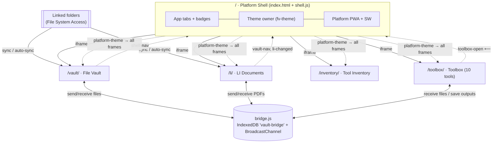

# File Database — Feature Tree & Application Topology

> A complete map of the platform: every feature, what it does, and what it's tied into.
> Matches the code as of this document's last commit. See `README.md` for user-facing docs.

---

## 0. Bird's-eye view

**File Database** is a static, no-build, offline-first PWA platform. The repo root is a
slim **shell** that hosts four independent apps in lazy, same-origin iframes. Apps never
talk to each other directly — everything cross-app goes through two thin channels:

- **`bridge.js` (VaultBridge)** — file handoffs (IndexedDB mailbox + BroadcastChannel nudge)
- **`postMessage`** — navigation + theme signals, always via the shell



Every app also runs **standalone** at its own URL with its own service worker and manifest —
the shell is a convenience layer, not a dependency.

---

## 1. Platform Shell — `/` (`index.html`, `shell.js`, `shell.css`, `sw.js`, `manifest.webmanifest`)

The only component that knows all four apps exist. Owns everything shared.

```
Platform Shell
├── App switching
│   ├── Four tabs: 📁 Files · 🗄️ LI Documents · 🔧 Tool Inventory · 🧰 Toolbox
│   ├── Lazy iframes — an app loads on first visit, then stays warm (instant switching)
│   ├── One panel visible at a time (ARIA tab pattern: arrow keys, Home/End, roving tabindex)
│   └── Last-used app remembered (localStorage "fd-app") and restored on launch
├── Tab badges (live counts)
│   ├── Files count      ← peeks IndexedDB "file-vault" / store "files"
│   ├── LI docs count    ← peeks IndexedDB "LIDocsDB" / store "docs"
│   ├── Tools count      ← peeks IndexedDB "tool-inventory" / store "tools"
│   ├── Read-only peek with upgrade-abort guard — can NEVER create/corrupt an app's DB
│   └── Refreshes on: app switch · window focus · tab visible · {li-changed} message
├── Theme (single source of truth for all four apps)
│   ├── ◐ button cycles System → Light → Dark
│   ├── Persists: localStorage "fv-theme" (set for light/dark, REMOVED for system)
│   ├── Applies: data-theme attribute on <html> + theme-color meta swap
│   ├── Broadcasts {platform-theme, mode} to every loaded iframe, and once per iframe load
│   └── System mode live-follows the OS via a prefers-color-scheme listener
├── Deep links & legacy URLs
│   ├── #vault (alias #files) · #li · #inventory · #toolbox · #toolbox/<toolKey>
│   ├── hashchange while open switches apps in place
│   ├── ?view=li|inventory → opens that app        (legacy hub URLs)
│   ├── ?view=starred / ?action=add → opens the vault WITH the query passed into its iframe
│   └── Consumed queries are stripped from the URL so reload follows the hash, not the shortcut
├── Message hub (window "message" listener)
│   ├── {shell-nav, app, tab?}        → activate app (tab forwarded to toolbox)
│   ├── {vault-nav, to:"files"}       → activate vault (legacy contract, still honored)
│   ├── {li-changed}                  → refresh tab badges
│   └── Queues messages for not-yet-loaded frames; flushed on the frame's load event
├── PWA (the installable "one app")
│   ├── manifest id "/" — pre-platform installs upgrade in place
│   ├── Shortcuts: Add files (?action=add) · Starred (?view=starred) · #li · #inventory
│   └── ⤓ Install button on beforeinstallprompt; hidden after install
└── Service worker (cache "platform-shell-v1")
    ├── Precache: shell core (required) + bridge.js/toolbox/icons (tolerant — can't brick install)
    ├── Fetch: skips /vault/ /li/ /inventory/ paths entirely (their own SWs rule there)
    ├── Navigations network-first, cached per-URL; assets cache-first
    └── Activate: prunes own old caches + legacy pre-platform "file-vault-*" root caches
```

**Tied into:** all four apps (iframes, theme broadcast, badges), three app IndexedDBs
(read-only), `bridge.js` only as a cached asset (the shell never sends/receives files).

---

## 2. File Vault — `/vault/` (`index.html`, `app.js`, `db.js`, `styles.css`, `sw.js`, `vendor/pdf*.js`)

The general-purpose file database. The platform's "hub" for incoming files from every other app.

```
File Vault
├── Adding files (5 ways in)
│   ├── ＋ Add files button / a keyboard shortcut → file picker (multi-select)
│   ├── Drag & drop anywhere onto the window (global overlay)
│   ├── Paste from clipboard (window "paste" listener)
│   ├── Folder sync (see below) — automatic
│   └── Bridge deliveries from LI Documents and Toolbox — automatic
├── Classification & preview
│   ├── Auto-sorted by kind: Images · Videos · Audio · PDFs · Documents · Spreadsheets
│   │   · Presentations · Text & code · Archives · Other  (sidebar "Types" tree w/ counts)
│   ├── Thumbnails generated on-device:
│   │   ├── Images  → scaled canvas JPEG
│   │   ├── Videos  → mid-point frame grab
│   │   └── PDFs    → first page rendered via vendored pdf.js (v3.11.174)
│   │       ├── pdf.js lazy-loads only when a PDF needs a preview (~1.5 MB, then SW-cached)
│   │       ├── Existing PDFs back-filled in the background, one at a time, persisted
│   │       │   without touching updatedAt (so "Recent" order never jumps)
│   │       └── Encrypted/broken PDFs keep the glyph icon (marked, never retried)
│   └── Detail drawer preview: image / video / audio player / PDF (native viewer iframe)
│       / inline text ≤512 KB / glyph fallback
├── Organizing
│   ├── Collections (create via menu or ＋; auto-created by sync & bridge imports)
│   ├── Tags (any number per file; tag cloud in sidebar; click = filter)
│   ├── Notes (free text per file)
│   ├── ★ Star (card, row, and detail toggles; "Starred" smart filter)
│   └── Detail drawer edits: name/collection/tags/VIN/note → Save
├── VIN grouping (⋮ → "Scan files for VINs" / sidebar ↻; Shift-click = full rescan)
│   ├── Reads every file for 17-char Vehicle Identification Numbers
│   │   ├── Filenames + text/CSV/RTF files → read directly (first 1 MB)
│   │   ├── PDFs → text layer via the vendored pdf.js (first 10 pages)
│   │   └── Images & scanned PDFs → OCR (Tesseract.js, lazy CDN — same
│   │       __TESS_* overrides as the LI app; first 3 pages rendered)
│   ├── Matching: charset [A-HJ-NPR-Z0-9]{17}, must mix letters+digits;
│   │   OCR text also retried with I→1 / O,Q→0 corrections
│   ├── Incremental: files are stamped vinScan when read, so re-runs only
│   │   touch new files; OCR-needing files skipped offline stay unstamped
│   ├── Stored per record (vins[]) without touching updatedAt; kept in
│   │   backups (.fvault) and shown as 🚗 chips on cards/rows
│   ├── 🚗 "By VIN" smart view — results grouped under one header per VIN
│   │   (header click = filter to that vehicle) + sidebar VIN list w/ counts
│   └── Detail drawer: editable VIN field + per-file "Detect" button
├── Finding
│   ├── Live search ("/" focuses) across name + tags + notes + collection + VINs
│   ├── Filters: All · Starred · Recent (40 newest) · By VIN · kind:x · collection:x · tag:x · vin:x
│   │   └── Active-filter chips with one-click removal
│   ├── Sort: Newest · Oldest · Name A→Z/Z→A · Largest · Smallest
│   └── Views: grid (g) / list (l) — choice persisted in DB meta "view"
├── Folder sync (⋮ → "Sync a folder…" / "Auto-sync")                    [Edge/Chrome]
│   ├── Link once via OS picker → handle persisted in DB meta "syncDir", restored on launch
│   ├── Scan = recursive walk (depth ≤8, ≤20k files) → import anything new or changed
│   │   ├── Dedup: name + size + source modified-time (srcMtime stored per record)
│   │   ├── Dedup set read fresh from the DB each scan (two open windows can't double-import)
│   │   └── Imports filed into a collection named after the folder
│   ├── Auto-sync toggle (persisted, DB meta "syncAuto"): rescans every 5 min while open
│   │   + on window focus + on tab-visible + once ~1.5 s after enabling
│   └── Auto path is silent-unless-something-imported and never permission-prompts
├── File actions (detail drawer footer)
│   ├── Open (new tab) · Download · Delete
│   ├── 🗄️ Send to LI      (PDFs)                → bridge target "li" + shell switches app
│   └── 🧰 Send to Toolbox (image/video/PDF/.csv/.zip) → bridge target "toolbox"
│       with meta.tab routing (media/pdf/csv/zip) + shell switches to that tool
├── Receiving (bridge target "vault") — the single intake for LI + Toolbox sends
│   ├── Files under meta.collection ("LI Documents" default / "Toolbox")
│   ├── LI metadata → tags (LI number, function group, "Model <series>") + note ("LI: title")
│   └── Thumbnails generated on arrival; toast announces the filing
├── Backup & restore
│   ├── Export whole vault → single .fvault file (blobs base64'd, thumbs included)
│   ├── Import .fvault (validates format "file-vault")
│   └── ⋮ → Request persistent storage (navigator.storage.persist)
├── Storage meter — sidebar bar + About dialog (navigator.storage.estimate; quota is the
│   browser's share-of-free-disk, not an app limit)
├── Keyboard: "/" search · "a" add · "g" grid · "l" list · Esc close (menu→detail→about)
└── Platform integration
    ├── Embedded (html.embedded): hides brand, theme button, install button;
    │   theme follows shell broadcasts; never writes fv-theme
    ├── Standalone: own ◐ theme cycle (prefers shared fv-theme, falls back to DB meta),
    │   own ⤓ install (manifest id "/vault/"), "vault-nav"-free — it IS the destination
    └── SW cache "vault-app-v2": precaches shell + ../bridge.js; pdf.js vendor cached at runtime
```

**Tied into:** bridge (both directions, 2 send targets + 1 receive), shell (shell-nav out,
platform-theme in, badge peeked), LI (receives its renamed PDFs; feeds it raw PDFs),
Toolbox (feeds it files; receives its outputs), File System Access (folder sync),
CDN (VIN-scan OCR only).

---

## 3. LI Documents — `/li/` (single-file app: `index.html` with inlined JSZip + pdf.js)

The Mercedes-Benz LI PDF specialist: parses, files, versions, renames.

```
LI Documents
├── Import & parse pipeline
│   ├── ＋ Import PDFs (files or a whole folder) · drag & drop · bridge (from vault)
│   ├── Reads each PDF's text (inlined pdf.js) and extracts:
│   │   LI number · version · title · reason for change · function group · date · validity
│   ├── Scanned PDFs → automatic OCR fallback (Tesseract.js, lazy CDN load — online-only,
│   │   like the vault's and Toolbox's OCR; overridable via window.__TESS_* globals)
│   ├── Model series derived from Validity (drives the model filter + vault tags)
│   ├── Dedup by content identity (LI+version) — re-imports update, never duplicate
│   └── ↻ Re-read all: re-runs the parser over every stored PDF, preserving hand edits
├── Library table
│   ├── Search: LI number, title, function group, or FULL TEXT of the PDFs
│   ├── Filters: function group · model series · ☆ starred · ⚠ needs review
│   │   └── "Needs review" = missing/suspect parsed fields (flagged during import)
│   ├── Row select + Select all → bulk: Delete selected · ⬇ Export renamed (ZIP)
│   └── Header shows doc/file/size totals (#storeInfo)
├── Document detail
│   ├── PDF preview pane (native viewer) + editable fields (LI, version, title, reason,
│   │   function group, date, validity) → Save (edits survive re-reads)
│   ├── Version picker — multiple versions of one LI live together; ← Back navigation
│   ├── Compare versions (diff overlay)
│   │   ├── Page mode: rendered pages diffed visually (red/green overlay)
│   │   └── Text mode: extracted-text diff with summary
│   ├── Renamed filename preview (canonical "LI…_ver Title.pdf" scheme)
│   ├── Copy: 📋 LI number · 📋 renamed filename · 🔗 permalink (#<LI> deep link)
│   ├── ⬇ Renamed download · Original download · ☆ star
│   └── ＋ File Vault → bridge send("vault") with full metadata
│       (vault files it under "LI Documents", tagged LI/fgroup/models)
├── Folder sync (☰ menu)
│   ├── 📂 Sync folder: link once, one click imports new/changed PDFs
│   │   (dedup name+size+mtime; Shift-click relinks a different folder)
│   └── ⏱ Auto-sync toggle (persisted): 5-min timer + focus/visibility rescans while open,
│       silent unless something imports, never permission-prompts
├── Save & backup (☰ menu)
│   ├── 🔄 Auto-save: writes the whole database to a chosen file after every change
│   │   (File System Access write handle, e.g. on a flash drive; warn state on permission loss)
│   ├── 💾 Backup / ↥ Restore (single-file export/import)
│   └── 📌 Install (desktop shortcut; hidden when embedded)
├── Notifications out
│   ├── {li-changed} → shell refreshes the LI tab badge after every data change
│   └── receive("li") registered with the bridge → vault's "Send to LI" lands here
└── Platform integration
    ├── Embedded: hides h1 / ← Files / Install; theme follows shell; ← Files posts vault-nav
    ├── Standalone: ← Files goes to ../index.html#vault; dark/light/system fully supported
    └── Own SW (li-db-shell-v1 / li-db-runtime-v1: nav network-first, CDN cache-first,
        assets stale-while-revalidate) + own manifest (scope /li/)
```

**Tied into:** vault (bi-directional file exchange via bridge), shell (badge, theme,
vault-nav), File System Access (sync folder + auto-save handles), CDN (OCR only).

---

## 4. Tool Inventory — `/inventory/` (`index.html`, `app.js`, `styles.css`, `tools.json`, `img/`, `sw.js`)

The Mercedes-Benz special-tools catalog: 1,688 master-list tools merged with the XENTRY
workshop-equipment catalog (999 offered, 995 with part photos).

```
Tool Inventory
├── Bundled catalog (tools.json, seed v4)
│   ├── Master list: tool number · description · service group · category (Ct) · bin
│   │   location · quantity · year · dealer-net price · notes
│   ├── XENTRY overlay per tool: offered flag · part photo · catalog name & description ·
│   │   WIS document + version · model validities (89 model-series export files)
│   └── Seed upgrades: SEED_VERSION bump re-seeds from tools.json while preserving stars,
│       user edits (location/qty/note/comment) and user-added rows
├── Browsing
│   ├── Search across tool number, descriptions, catalog text, location, WIS, comments
│   ├── Filters: service group · category (Ct) · note code · 🛒 Offered · ★ Starred
│   ├── Sort by any column (asc/desc)
│   ├── Part-photo thumbnails in the list (lazy-loaded, SW-cached after first view)
│   └── Header stats: total · offered · with photo
├── Detail view
│   ├── Full record + part photo + catalog description + model validities list
│   ├── Editable: location · quantity · note · comment (edit flags preserved across re-seeds)
│   └── ★ star toggle
├── Data management (☰ menu)
│   ├── Import CSV (refresh/extend the list) · Export CSV (current filtered rows)
│   ├── Backup / Restore whole database (format "tool-inventory")
│   ├── Reset to bundled list · Legend (category/note explanations)
│   └── tools.json fetched network-first by the SW → catalog refreshes don't need cache bumps
└── Platform integration
    ├── Embedded: hides h1 / install; "⌂ File Database" link only shows standalone
    ├── Theme: full light/dark/system (platform-theme listener + pre-paint script)
    ├── No bridge usage — it's a reference catalog, not a file inbox
    └── Own SW (tool-inventory-v5) + manifest (scope /inventory/); shell badge peeks its DB
```

**Tied into:** shell only (badge, theme). Deliberately isolated otherwise.

---

## 5. Toolbox — `/toolbox/` (single-file app: `index.html` with inlined pdf-lib, pdf.js, JSZip)

Ten local file utilities (imported from the File-Compressor project), wired into the platform.

```
Toolbox
├── 📦 Zip Splitter
│   ├── Split one ZIP by file count or by max part size (never exceeds target)
│   ├── Output zipped (.zip per part) or unzipped (real folders via directory picker,
│   │   or one extract-to-folders ZIP on other browsers)
│   └── Preserves inner folder structure; per-part or download-all
├── 🎬 Media Compressor
│   ├── Photos: quality/dimension reduction (canvas re-encode)
│   └── Videos: MediaRecorder + captureStream re-encode → WebM
├── 🔤 Image to Text (OCR) — Tesseract.js (lazy CDN; paste an image directly onto the tab)
├── 📐 Unit Converter — many categories (length/mass/temp/data/…)
├── ⚡ Electrical — Ohm's law & power · series/parallel resistors · voltage divider ·
│   LED resistor · color codes (4-band and 5/6-band) · SMD codes · reactance ·
│   energy cost · dBm⇄W · wire gauge (AWG) · battery life
├── 📝 Text — editor + counters · find & replace · side-by-side compare (diff)
├── 🧮 Calculators — percentage · discount/sale price · date difference/age · mileage/trip cost
├── 📊 CSV Viewer — sortable, searchable table; export back to CSV/JSON
├── 🖼️ Image Tools — format converter (batch + zip-all) · crop/rotate/resize · EXIF
│   viewer & stripper (incl. GPS link)
├── 📕 PDF Toolkit — organize & merge (reorder/rotate/delete pages) · images→PDF ·
│   extract pages as images · Rename Mercedes-Benz LI Documents (regex + OCR fallback)
└── Platform integration
    ├── Tool tabs deep-linkable: shell #toolbox/<key> → {toolbox-open} → window.__openTab
    │   (keys: zip media ocr convert elec text calc csv img pdf; also #<key> standalone)
    ├── Receive from vault: bridge receive("toolbox") → picks tab from meta.tab (or MIME)
    │   → injects the file into that tool's input (DataTransfer + change event)
    ├── Save to File Vault: EVERY output path (all download helpers + media/OCR results)
    │   raises a snackbar → 💾 Save to File Vault → bridge send("vault", collection "Toolbox")
    ├── Theme: full light/dark/system on the shared tokens; brand hidden when embedded
    └── No own SW/manifest — the SHELL's service worker precaches this page
```

**Tied into:** vault (receives files, sends outputs — both via bridge), shell (tab
deep-links, theme, toolbox-open), CDN (OCR only).

---

## 6. Shared infrastructure

### 6.1 `bridge.js` — VaultBridge (the file bus)

| Aspect | Detail |
|---|---|
| Transport | IndexedDB **`vault-bridge`** / store `outbox` (id autoIncrement, index `target`) — file Blobs travel as structured clones, never over postMessage |
| Wake-up | `BroadcastChannel("vault-bridge")` nudge `{kind:"incoming", target}` + drain on receive() registration, window focus, and a 2.5 s poll fallback |
| API | `send(target, {name, type, blob, meta})` · `receive(target, handler)` · `drain(target)` |
| Targets | `"vault"` (LI + Toolbox send here) · `"li"` (vault sends PDFs) · `"toolbox"` (vault sends work files) |
| Delivery | **Atomic claim-by-delete** before handling — two live instances of one app (shell + standalone tab) can't both import an item; failed handlers **requeue** for retry |
| Durability | send() resolves when queued — the receiver may not even be open yet; items wait in the outbox until claimed |

### 6.2 postMessage contract (navigation & theme — no file bytes ever)

| Message | Direction | Effect |
|---|---|---|
| `{type:"shell-nav", app, tab?}` | app → shell | Switch apps (tab forwarded to toolbox) |
| `{type:"vault-nav", to:"files"}` | app → shell | Legacy: switch to Files |
| `{type:"li-changed"}` | LI → shell | Refresh tab badges |
| `{type:"platform-theme", mode}` | shell → every frame | Apply system/light/dark |
| `{type:"toolbox-open", tab}` | shell → toolbox | Activate a tool tab |

### 6.3 Storage map (all origin-scoped — same origin = same data)

| Store | Owner | Contents |
|---|---|---|
| IndexedDB `file-vault` (files, meta) | Vault | File records + blobs + thumbs; meta: theme, view, collections, syncDir, syncAuto |
| IndexedDB `LIDocsDB` (docs, files, settings) | LI | Parsed docs, PDF blobs; settings: autosave/autosaveOn/syncDir/autoSyncOn handles |
| IndexedDB `tool-inventory` (tools, meta) | Inventory | 1,688 tool rows; meta: source, seedVersion |
| IndexedDB `vault-bridge` (outbox) | bridge.js | In-flight cross-app file handoffs |
| localStorage `fv-theme` | Shell (embedded) / Vault (standalone) | "light"/"dark"; absent = system. Read by every app's pre-paint script |
| localStorage `fd-app` | Shell | Last-used app tab |

### 6.4 Service workers (each prunes ONLY its own cache prefix)

| Scope | File | Cache | Strategy highlights |
|---|---|---|---|
| `/` | `sw.js` | `platform-shell-v1` | Skips /vault/ /li/ /inventory/; tolerant precache; cleans legacy `file-vault-*` |
| `/vault/` | `vault/sw.js` | `vault-app-v2` | Precaches shell + `../bridge.js`; pdf.js vendor cached at runtime |
| `/li/` | `li/sw.js` | `li-db-shell-v1` + runtime | Nav network-first; Tesseract CDN cache-first |
| `/inventory/` | `inventory/sw.js` | `tool-inventory-v5` | `tools.json` network-first; part photos cached lazily |

### 6.5 Theme system (one choice, five consumers)

```
◐ toggle (shell when embedded; vault standalone)
   → localStorage "fv-theme" (light/dark; removed = system)
   → data-theme attribute on each document's <html>
       ├── set pre-paint by a tiny head script in ALL FIVE pages (no flash)
       ├── updated live by {platform-theme} broadcasts (embedded)
       └── CSS pattern everywhere: :root = light tokens ·
           :root[data-theme=dark] + prefers-color-scheme fallback = dark tokens
```

All apps share the same palette values (dark `#0f1420` family / light `#f4f6fb` family,
accents `#5b8cff`/`#47d18f`) on their own token names.

### 6.6 Embedded-mode contract

Every app runs a head script: `window.parent !== window` → `<html class="embedded">`.
CSS under `html.embedded` hides per-app chrome the shell already provides:
brand/h1 · back-to-platform links · install buttons · (vault) theme toggle.
Everything functional stays. Standalone keeps 100 % of the chrome.

---

## 7. Cross-app flows (end to end)

| # | Flow | Steps |
|---|---|---|
| 1 | **Vault → LI** | PDF detail → 🗄️ Send to LI → bridge `send("li")` → shell-nav switches to LI → LI claims item → full parse pipeline (OCR if scanned) → filed by LI number → `{li-changed}` → badge updates |
| 2 | **LI → Vault** | Doc detail → ＋ File Vault → bridge `send("vault")` w/ meta {li, title, fgroup, date, validity, ver, modelSeries} → vault claims → files under "LI Documents", tags LI/fgroup/Model-series, note "LI: title", PDF thumb rendered |
| 3 | **Vault → Toolbox** | File detail → 🧰 Send to Toolbox → bridge `send("toolbox", meta.tab)` → shell-nav (+tab) → toolbox claims → opens the tool tab → injects file into its input, ready to run |
| 4 | **Toolbox → Vault** | Any tool produces output → download starts + snackbar → 💾 Save to File Vault → bridge `send("vault", collection:"Toolbox")` → vault files it (thumbnail included) |
| 5 | **Folder → Vault** | Drop file in linked folder → auto-sync tick (5 min / focus / visible) → scan diff (name+size+mtime) → import into folder-named collection → badge updates |
| 6 | **Folder → LI** | Drop PDF in linked folder → LI auto-sync tick → importFiles pipeline (parse/OCR/dedup) → `{li-changed}` |
| 7 | **Theme** | ◐ click in shell → attr + fv-theme + broadcast → all four frames restyle instantly; late-loading frames pick it up from the pre-paint script + on-load broadcast |

---

## 8. Tie-in matrix (who depends on what)

| Component | bridge.js | shell messages | fv-theme | File System Access | Other apps' DBs | CDN |
|---|---|---|---|---|---|---|
| Shell | cached only | hub (all) | **owner** (embedded) | — | reads 3 (badges) | — |
| Vault | send li/toolbox · receive vault | shell-nav out · theme in | owner (standalone) | sync folder | — | Tesseract (VIN OCR) |
| LI | send vault · receive li | vault-nav/li-changed out · theme in | reads | sync folder · auto-save file | — | Tesseract (OCR) |
| Inventory | — | theme in | reads | — | — | — |
| Toolbox | send vault · receive toolbox | toolbox-open/theme in | reads | zip-to-folder picker | — | Tesseract (OCR) |

Isolation guarantees worth knowing:
- **Removing an app** breaks nothing else — the shell tab would just 404; bridge items for it would wait unclaimed.
- **DB names are contracts**: `file-vault`, `LIDocsDB`, `tool-inventory`, `vault-bridge` are peeked/shared by name; renaming one silently breaks badges or handoffs.
- **Same-origin is the platform**: bridge and theme both die across origins. Deploy everything from one origin (GH Pages path is fine).

---

## 9. Test coverage map (`npm test` — 7 suites, all headless Chromium)

| Suite | Guards |
|---|---|
| `e2e.mjs` | Vault standalone: add/search/filter/tags/collections/star/detail/export-import/theme cycle/SW scope/install |
| `e2e-merge.mjs` | Cross-app through the shell: vault→LI send + parse, LI→vault send + tagging, vault→toolbox send + tool injection, bridge outbox |
| `e2e-inventory.mjs` | Inventory standalone (catalog, photos, filters, edits, seed-upgrade preserving stars/edits) + embedded chrome + badge-peek regression |
| `e2e-shell.mjs` | Tabs/panels/lazy loading, theme broadcast to all frames, deep links (#toolbox/pdf, #files), legacy queries, badges, toolbox→vault save |
| `e2e-sync.mjs` | Folder sync with a mocked directory picker: link/import/dedup/changed-file re-import/auto-sync timer + persistence |
| `e2e-pdfthumb.mjs` | PDF thumbnails: import-time render, IndexedDB persistence, background backfill after reload |
| `e2e-vin.mjs` | VIN scan & grouping: content/filename/PDF-text detection, By-VIN grouped view, vin: filter, sidebar list, search, detail field, persistence, incremental re-scan + offline OCR skip |

---

## 10. Source layout

```
/                       Platform shell (index.html · shell.js · shell.css · sw.js · manifest)
├── bridge.js           Cross-app file bus (shared by vault, li, toolbox)
├── icons/              Platform PWA icons (tools/gen_icons.py writes here + vault/icons)
├── vault/              File Vault (app.js · db.js · styles.css · sw.js · manifest · icons/)
│   └── vendor/         pdf.js + worker (PDF first-page thumbnails, offline)
├── li/                 LI Documents (single index.html: app + inlined JSZip/pdf.js/worker)
├── inventory/          Tool Inventory (app.js · styles.css · tools.json · img/ 862 photos · sw.js)
├── toolbox/            Toolbox (single index.html: 10 tools + inlined pdf-lib/pdf.js/JSZip)
└── tools/              gen_icons.py + the six e2e suites (playwright-core)
```
